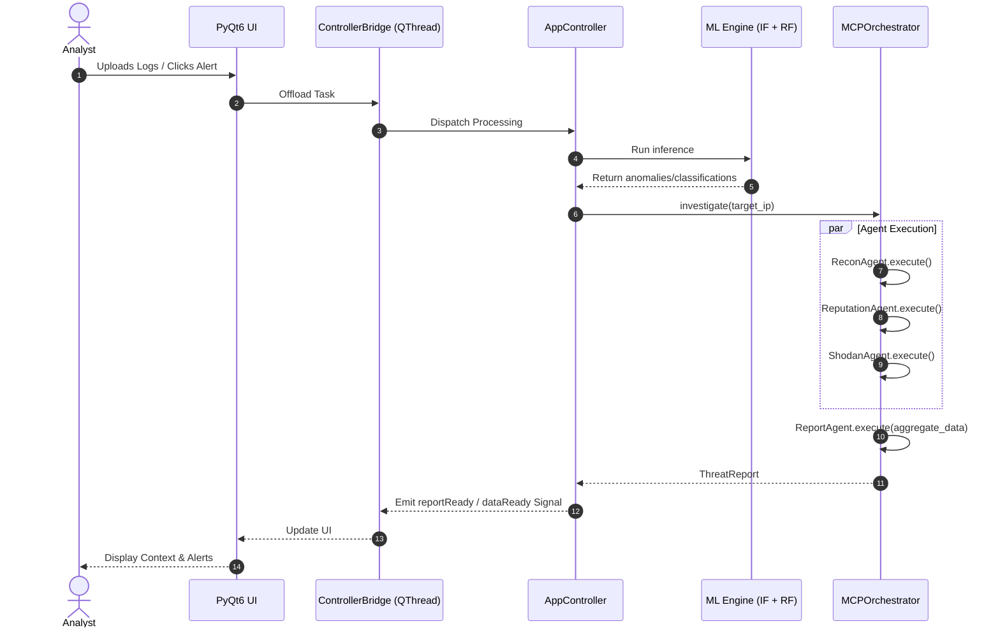
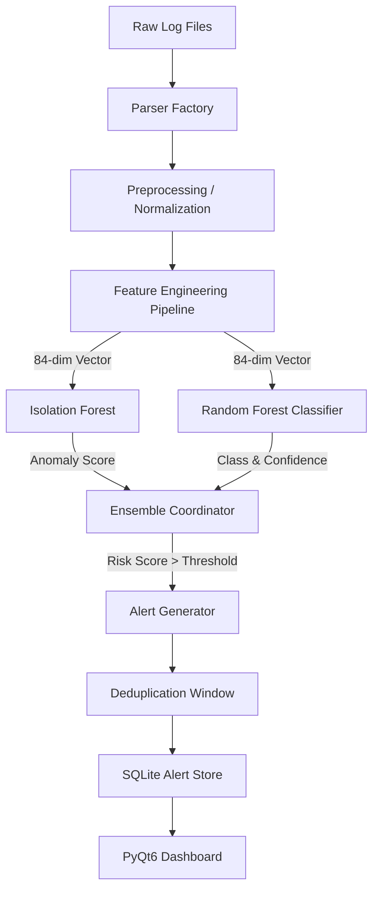
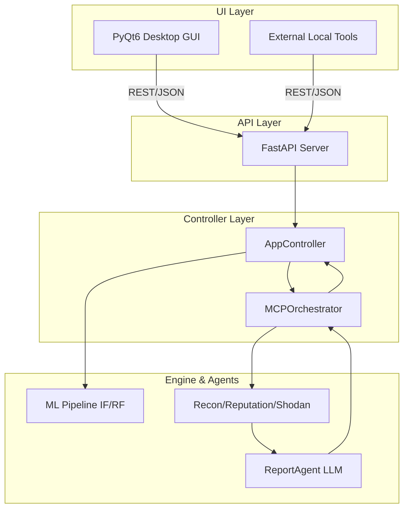

# SOC Copilot Architecture & Roadmap

---

## PART 1 — HOW IT WORKS RIGHT NOW

### 1. Executive Summary

**What SOC Copilot is and what problem it solves:**
SOC Copilot is a fully offline, desktop-based Security Information and Event Management (SIEM) and Intrusion Detection System (IDS) designed to provide intelligent, automated threat detection. It solves the problem of alert fatigue and complex, noisy security logs by automatically detecting anomalous behaviors and classifying explicit attacks using a hybrid machine learning model. Because it operates entirely locally, it addresses the severe privacy and compliance constraints of highly sensitive, air-gapped environments.

**Who uses it and in what context:**
SOC Copilot is built for security analysts, incident responders, and network administrators who require a fast, low-overhead, secure detection platform on local workstations. It is typically deployed in single-user or small-team contexts on dedicated hardware (Windows/macOS/Linux) where shipping logs to a cloud provider is impossible due to regulatory or security policies.

**What it can do today:**
Today, SOC Copilot successfully ingests and parses multiple log formats (CSV, JSON/JSONL, Syslog, Windows EVTX) and extracts up to 84 distinct features across statistical, temporal, behavioral, and network dimensions. It runs this data through an offline ML ensemble—using an Isolation Forest for unsupervised anomaly detection and a Random Forest (trained on CICIDS2017) for multi-class attack classification. It dedupes these findings, calculates risk scores using an Ensemble Coordinator, and presents prioritized, explainable alerts via a PyQt6 desktop GUI. It also has a foundational (though partially incomplete) Multi-Agent Cyber-investigation Pipeline (MCP) for enriching threat intelligence.

### 2. Current Architecture

#### Full Project Structure

The repository is modular and split into phases, ensuring separation of concerns between data ingestion, machine learning inference, governance, and user interface.

```text
src/soc_copilot/
├── core/                  # Core configurations, logging, and base exceptions
├── data/                  # Log ingestion, multi-format parsing, and feature engineering
├── models/                # ML Pipeline: Isolation Forest, Random Forest, Ensemble Coordinator
├── mcp/                   # Agentic Pipeline: Recon, Reputation, Shodan, and Report agents
├── phase3/governance/     # Phase 3 Governance: Kill switches, policy overrides, audit logging
├── phase4/                # Application orchestration layer
│   ├── controller/        # AppController for bridging ML pipeline, logs, and state
│   ├── ingestion/         # Log watching, buffers, and system readers
│   └── ui/                # PyQt6 GUI: Dashboard, Alerts, Config panels, controller bridge
└── cli.py                 # Command Line Interface
```

#### Module Responsibilities

- **`core/`**: Provides the foundational building blocks. It exists to guarantee structured logging (`structlog`) and uniform configuration without circular dependencies.
- **`data/`**: Manages the ETL pipeline. `log_ingestion/` abstracts away log formats (CSV, EVTX, etc.), while `feature_engineering/` extracts 64-78 dimensional vectors required by the models. This separation allows new log formats to be added without touching the ML logic.
- **`models/`**: Houses the detection engine. `inference/` manages loading serialized `joblib` models safely, while `ensemble/coordinator.py` merges the anomaly scores and classification confidences to determine final risk severity.
- **`mcp/`**: Contains the 4-agent investigatory pipeline (`ReconAgent`, `ReputationAgent`, `ShodanAgent`, `ReportAgent`) orchestrated by `MCPOrchestrator`. It exists to automate the manual threat intel gathering process analysts typically perform.
- **`phase4/controller/`**: Acts as the central nervous system. The `AppController` pulls data from the ingestion layer, pushes it to the models, and stores results, decoupling the heavy lifting from the UI thread.
- **`phase4/ui/`**: The desktop presentation layer built in PyQt6. It leverages a `ControllerBridge` via `QThread` to interact with the backend, ensuring the interface remains highly responsive during intense log processing.

#### Request Flow (UI to Result)

When a user interacts with the system (e.g., uploading a log file or clicking an alert), the request traverses a strict boundary between the UI thread and the processing thread to prevent GUI lockups.



#### Data Flow (Ingestion to Alert)

Network traffic and system logs enter the system through a unified pipeline that prepares, scores, and filters the data.



- **Why it is built this way:** The bifurcated ML approach (Isolation Forest alongside Random Forest) ensures the system can detect zero-day anomalies (via IF) while retaining high-precision categorization for known threats like DDoS or BruteForce (via RF). Deduplication occurs post-generation to prevent alert storms and analyst fatigue.

#### MCP Orchestrator & Async Coordination

The `MCPOrchestrator` uses Python's `asyncio.gather()` to run `ReconAgent`, `ReputationAgent`, and `ShodanAgent` concurrently.

- **Why asyncio?** Threat intelligence APIs (VirusTotal, AbuseIPDB, Shodan) are heavily I/O-bound. Running them synchronously would block the pipeline for 10-15 seconds per IP. `asyncio.gather(return_exceptions=True)` ensures that if Shodan fails or times out (10s max), the Recon and Reputation results are still captured and passed to the `ReportAgent`.

#### Threat Intelligence Merging

Threat intelligence APIs are called in the `mcp` layer. `ReputationAgent` hits VirusTotal and AbuseIPDB, while `ReconAgent` handles WHOIS/GeoIP.

- **Why this separation?** It limits blast radius. If VirusTotal revokes an API key, only `ReputationAgent` suffers a `PARTIAL` failure state. The `ReportAgent` then accepts these disjointed outputs (via Pydantic `BaseModel` objects) and feeds them into the Claude LLM to synthesize a final `ThreatReport`.

### 3. Component Deep Dives

#### MLModel (Isolation Forest + Random Forest)

- **What it does:** Scans 84-dimensional network flow data to detect anomalies and explicitly classify known attacks (DDoS, BruteForce, Malware, etc.).
- **Why it was built this way:** The hybrid approach balances detecting known threats (high precision, low false-positive rate via RF) and unknown zero-day anomalies (broad recall via IF).
- **Inputs/Outputs:** Takes numerical and categorical normalized vectors. Outputs a composite Risk Score (0.0 to 1.0) and a string classification with confidence percentage.
- **Known limitations:** `src/soc_copilot/models/inference/engine.py` (line 152) — Requires serialized `joblib` artifacts which inherently introduce supply-chain risks, hence the reliance on strict file hash verification. It can also cause high memory spikes during batch loading.

#### MCPOrchestrator

- **What it does:** Acts as the traffic cop for automated threat intelligence gathering.
- **Why it was built this way:** To speed up analyst workflows by fetching contextual data in parallel instead of making analysts alt-tab to browser windows for lookup APIs.
- **Inputs/Outputs:** Takes an IP address string. Outputs a structured `ThreatReport` containing recon, reputation, and Shodan data wrapped by an LLM-generated summary.
- **Known limitations:** `src/soc_copilot/mcp/orchestrator.py` (line 55) — Currently mostly a scaffold. Lacks the full `diskcache` integration for the `ip:<target>` key format and has yet to implement the `asyncio.gather` execution logic.

#### ReconAgent

- **What it does:** Performs passive IP reconnaissance (WHOIS, reverse-DNS, ASN, and GeoIP).
- **Why it was built this way:** Uses a mix of blocking Python libraries (`ipwhois`, `socket`) via thread pool executors and async HTTP clients (`httpx`) to ensure the agent remains non-blocking to the main orchestrator event loop.
- **Inputs/Outputs:** Takes an IP string. Outputs a `ReconResult` containing registrar, organization, ASN boundaries, and geolocation coordinates.
- **Known limitations:** `src/soc_copilot/mcp/recon_agent.py` (line 62) — Heavily reliant on free APIs (`ipwho.is`) which are prone to rate-limiting in high-volume environments.

#### ReputationAgent

- **What it does:** Queries AbuseIPDB and VirusTotal to establish the malicious reputation of an IP.
- **Why it was built this way:** Two independent sources provide stronger confidence in malicious verdicts. Async `httpx` calls guarantee the agent completes within a strict timeout window.
- **Inputs/Outputs:** Takes an IP string. Outputs a `ReputationResult` with an AbuseIPDB confidence score (0-100) and a VirusTotal detection ratio.
- **Known limitations:** `src/soc_copilot/mcp/reputation_agent.py` (line 173) — Scaffold pending API key validation integration. Hard dependency on environmental variables being set correctly.

#### ShodanAgent

- **What it does:** Discovers exposed ports, running service banners, and known CVEs associated with an IP.
- **Why it was built this way:** Gives analysts immediate insight into whether an attacking IP is a compromised IoT device or a known command-and-control infrastructure node.
- **Inputs/Outputs:** Takes an IP string. Outputs a `ShodanResult` listing open ports and CVE strings.
- **Known limitations:** `src/soc_copilot/mcp/shodan_agent.py` (line 33) — Currently just a `NotImplementedError` scaffold.

#### ReportAgent

- **What it does:** Synthesizes the raw data from the other three agents using Anthropic's Claude API.
- **Why it was built this way:** Analysts need immediate context and actionable summaries, not just raw JSON blocks. The LLM translates raw intelligence into a severity-rated (CRITICAL/HIGH/MEDIUM/LOW) tactical assessment.
- **Inputs/Outputs:** Takes aggregated `ReconResult`, `ReputationResult`, and `ShodanResult`. Outputs a final `ThreatReport`.
- **Known limitations:** `src/soc_copilot/mcp/report_agent.py` (line 58) — Currently a scaffold. High latency expected (Claude API calls can take 15-30s), requiring a longer agent timeout (30s).

#### PyQt6 GUI

- **What it does:** Provides the desktop application interface, comprising a Dashboard, Alerts View, Config Panel, and System Status Bar.
- **Why it was built this way:** To meet the strict "offline desktop-first" requirement. PyQt6 is robust, cross-platform, and allows for complex table rendering required for log analysis.
- **Inputs/Outputs:** Takes user clicks and file paths. Outputs visual graphs, rendered data tables, and sends signals to the ControllerBridge.
- **Known limitations:** `src/soc_copilot/phase4/ui/dashboard_v2.py` (line 377) — The main thread can still stutter if large datasets are loaded into `QTableWidget` without pagination or chunking.

#### Config/Auth Layer

- **What it does:** Manages system configuration (thresholds, model hyperparameters, feature definitions) via YAML files in the `config/` directory.
- **Why it was built this way:** Decoupling configuration from code allows administrators to tune detection thresholds and deduplication windows without recompiling or altering Python files.
- **Inputs/Outputs:** Reads `.yaml` files. Outputs Python dictionaries or Pydantic validation models.
- **Known limitations:** `src/soc_copilot/core/config.py` (line 12) — File permissions must be strictly managed by the host OS; there is no internal encryption of the YAML threshold logic.

### 4. Current Strengths

- **Air-Gapped Viability:** The core hybrid ML pipeline and GUI run completely isolated from the internet. This is a massive strength for deployments in classified or highly regulated environments.
- **Explainability:** The system refuses to be a "black box." The `EnsembleCoordinator` breaks down exactly why an alert fired, providing contributing factors (e.g., "Risk boosted: severe threat with anomalous behavior") mapped to MITRE attack categories.
- **Resilient Threading:** The `ControllerBridge` (utilizing QThread) effectively shields the PyQt6 GUI from freezing during heavy inference workloads or large file ingestion.

### 5. Resolved Technical Debt

The following significant technical debt items have been explicitly addressed and resolved to stabilize the Phase-1 core:

1. **KillSwitch Import Path Bug**
   - **The Problem:** The governance kill switch was throwing `ImportError` exceptions due to relative import path confusion across the Phase 3 (Governance) and Phase 4 (UI/App Orchestration) boundaries.
   - **Where it lived:** `src/soc_copilot/cli.py` and `src/soc_copilot/phase4/ui/config_panel.py`.
   - **The Fix:** Imports were updated to strict absolute paths (e.g., `from soc_copilot.phase3.governance import KillSwitch` and `from soc_copilot.phase4.kill_switch import KillSwitch`), resolving boundary resolution conflicts.

2. **Unsafe `joblib.load()` Operations**
   - **The Problem:** The system loaded ML models using `joblib.load()` directly. Since `joblib` (like `pickle`) can execute arbitrary code during deserialization, this represented a severe remote code execution (RCE) vulnerability if a malicious model file was placed in the data directory.
   - **Where it lived:** `src/soc_copilot/models/inference/engine.py` (lines 152 and 163).
   - **The Fix:** A `verify_model_file(path)` check was wrapped around the load functions. The engine now halts and throws a `RuntimeError` if the SHA-256 hash of the `.joblib` file does not match the trusted signatures in `model_hashes.json`.

3. **f-string SQL Queries**
   - **The Problem:** SQLite databases (used for the alert store, kill switch state, and governance logs) were dynamically constructing SQL queries using Python f-strings, exposing the application to SQL injection (SQLi) attacks.
   - **Where it lived:** `src/soc_copilot/phase3/governance/killswitch.py` and `approval.py`.
   - **The Fix:** All direct string interpolations in `.execute()` calls were replaced with parameterized database queries (`SET enabled = ? ... (enabled,)`), delegating sanitization to the `sqlite3` library.

4. **Scikit-learn Version Mismatch**
   - **The Problem:** The environment was failing to load serialized Random Forest models correctly because the inference environment's `scikit-learn` version drifted from the training environment's version, breaking tree node deserialization.
   - **Where it lived:** `pyproject.toml` and local virtual environments.
   - **The Fix:** The dependency was pinned tightly to `scikit-learn>=1.3.0` in `pyproject.toml`, forcing uniform environments across developer testing and PyInstaller build pipelines.

---

## PART 2 — WHERE IT SHOULD GO

### 6. Future Vision

In the next 12 months, SOC Copilot must transition from a purely reactive analysis tool into an active investigation platform, primarily by exposing its capabilities through a Multi-Agent Cyber-investigation Pipeline (MCP). Ultimately, the application will integrate a FastAPI backend layer to allow the desktop application to act as a local MCP server, allowing external agents or trusted local network services to query its intelligence securely.

**Scope Guardrails (What it will NOT become):**

- **A cloud-based SaaS:** SOC Copilot will remain strictly offline and desktop-first. Data sovereignty is the primary value proposition.
- **An enterprise Splunk/Elastic replacement:** It is a localized, tactical assistant, not a petabyte-scale data lake.
- **A general-purpose AI assistant:** The LLM integration is strictly sandboxed to threat reporting; it will not answer general queries.
- **Dependent on paid APIs for core detection:** The ML models handle core detection offline. APIs (VirusTotal, Shodan) are for enrichment only.

### 7. Milestone Roadmap (1-4 Week Sprint)

The immediate priority is completing the scaffolded MCP integration. The following milestones represent a tight, phased sequence to bring automated threat investigation to the UI.

#### Milestone 1: Reputation and Shodan Agent Implementation (Done 05/07/2026 08:00PM)

- **Goal:** Replace the `NotImplementedError` scaffolds in `ReputationAgent` and `ShodanAgent` with working async API calls.
- **Why it matters:** Brings critical external context (malware history, open ports) to raw IP addresses, drastically reducing manual lookup time.
- **Files affected:** `src/soc_copilot/mcp/reputation_agent.py`, `src/soc_copilot/mcp/shodan_agent.py`.
- **Estimated complexity:** Low
- **Dependencies:** None
- **Acceptance criteria:** Unit tests pass for both agents; API timeouts correctly yield `AgentStatus.TIMEOUT` or `PARTIAL` results without crashing.
- **Risks:** Missing API keys causing silent failures (mitigated by existing `APIKeyMissingError` logic).

#### Milestone 2: Claude LLM Report Agent (Done 07/07/2026 11:00PM but with different LLM)

- **Goal:** Connect the `ReportAgent` to the Anthropic Claude API to consume the outputs of agents 1-3 and output a structured `ThreatReport`.
- **Why it matters:** Human-readable summaries and severity ratings (CRITICAL/HIGH/MEDIUM/LOW) are required to make raw intel actionable for Tier 1 analysts.
- **Files affected:** `src/soc_copilot/mcp/report_agent.py`.
- **Estimated complexity:** Medium
- **Dependencies:** Milestone 1 (needs the data outputs to build the LLM prompt).
- **Acceptance criteria:** Agent correctly formats the `REPORT_SYSTEM_PROMPT` and parses Claude's response into the Pydantic `ThreatReport` model.
- **Risks:** High latency from the Claude API leading to orchestrator timeouts.

#### Milestone 3: Orchestrator Parallelization & Caching (Done 09/07/2026 02:00AM)

- **Goal:** Implement `asyncio.gather()` in `MCPOrchestrator` to run the collection agents concurrently, and implement the 6-hour TTL `diskcache`.
- **Why it matters:** Running API lookups synchronously takes too long. Caching prevents rate-limiting and redundant API costs for frequently attacking IPs.
- **Files affected:** `src/soc_copilot/mcp/orchestrator.py`.
- **Estimated complexity:** Medium
- **Dependencies:** Milestones 1 & 2.
- **Acceptance criteria:** Orchestrator completes all 3 collection tasks in ~10 seconds. Duplicate requests within 6 hours return instantly from `diskcache`.
- **Risks:** Thread exhaustion or unhandled exceptions in `asyncio.gather` tearing down the main loop.

#### Milestone 4: PyQt6 UI Binding

- **Goal:** Bind the orchestrator to the GUI so that double-clicking an IP in the `AlertsView` triggers the investigation asynchronously.
- **Why it matters:** This is the actual user feature—connecting the backend pipeline to analyst interactions.
- **Files affected:** `src/soc_copilot/phase4/ui/alerts_view.py`, `src/soc_copilot/phase4/ui/controller_bridge.py`.
- **Estimated complexity:** High
- **Dependencies:** Milestone 3.
- **Acceptance criteria:** Double-clicking table column 2 (IP) fires a `QRunnable` task to the `QThreadPool`, executing the orchestrator, and emitting a custom `reportReady` Qt signal to display a modal dialogue with the `ThreatReport`. The UI must not freeze.
- **Risks:** Executing `asyncio` loops inside Qt threads requires careful management to prevent deadlocks or segment faults.

#### Milestone 5: Provider & Connectivity Layer

- **Goal:** Build a provider management layer that tracks the live status of each external service (NVIDIA NIM, Shodan, AbuseIPDB, VirusTotal) and makes the pipeline resilient to missing keys or offline providers.
- **Why it matters:** This is the online/offline resilience story — the orchestrator must degrade gracefully to local-only mode when a provider is unavailable, rather than failing the entire pipeline.
- **Files affected:** `src/soc_copilot/phase4/ui/config_panel.py`, `src/soc_copilot/mcp/orchestrator.py`, new `src/soc_copilot/mcp/provider_registry.py`.
- **Estimated complexity:** Medium
- **Dependencies:** Milestone 3.
- **Acceptance criteria:**
  - PyQt6 settings panel renders a provider card per service showing one of: `Configured`, `Missing key`, or `Offline`.
  - `check_provider_status()` performs a lightweight ping/auth check per provider and caches the result briefly.
  - Orchestrator reads live provider status at dispatch time; any provider that is down or unkeyed marks its corresponding agent as `Disabled` and the pipeline continues in local-only/offline mode.
- **Risks:** Ping checks adding latency to startup; mitigate by running checks lazily on first use and caching aggressively.
- **Status:** Not started

#### Milestone 6: Live Workflow Visualization (PyQt6-native)

- **Goal:** Embed an animated, real-time pipeline graph directly in the dashboard so analysts can see exactly which stage is active and where an investigation is in flight.
- **Why it matters:** Provides immediate visual feedback during long-running investigations and makes the system's internal logic transparent — a key differentiator for demos and interviews.
- **Files affected:** New `src/soc_copilot/phase4/ui/pipeline_graph_widget.py`; `src/soc_copilot/phase4/ui/dashboard_v2.py`; `src/soc_copilot/phase4/controller/app_controller.py`.
- **Estimated complexity:** High
- **Dependencies:** Milestone 4 (signals infrastructure must exist before wiring).
- **Acceptance criteria:**
  - `PipelineGraphWidget(QGraphicsView)` is embedded in the dashboard with one `QGraphicsScene` per graph.
  - `NodeItem(QGraphicsItemGroup)` exists for each stage (Parser, Feature Engineering, Isolation Forest, Random Forest, Ensemble, Alert Generator, DB, Recon, Reputation, Shodan, Report Agent); `set_status()` drives node color via `QPropertyAnimation`.
  - Stage connections are drawn with `QPainterPath` curved lines (n8n-style).
  - `AppController` emits a `pipeline_stage_updated` Qt signal per stage transition; `PipelineGraphWidget` listens and updates nodes live.
  - Double-clicking an alert opens a second graph instance showing the investigation sub-pipeline with parallel Recon/Reputation/Shodan branches.
  - Packet animation: a small `QGraphicsEllipseItem` travels along the connection path between active nodes.
  - Replay mode: each run logs `(stage, status, timestamp, data)`; a `QTimer` re-emits the signals on demand so any past run can be replayed without re-uploading logs.
- **Build order:** static graph → real signal wiring → sub-graph on alert double-click → packet animation → replay mode.
- **Risks:** `QGraphicsScene` performance degrades with many animated items; mitigate by limiting concurrent packet animations and pausing off-screen nodes.
- **Status:** Not started

### 8. Target Architecture (with FastAPI)

Once the MCP pipeline is complete, the application will introduce a FastAPI layer. This shifts the `AppController` behind an HTTP interface, allowing the PyQt6 GUI (or external tools) to communicate via standard REST/JSON, turning SOC Copilot into a true local MCP server.



### 9. Risk Analysis

| Risk | Current State | What breaks if ignored | Recommended Mitigation |
|------|---------------|------------------------|------------------------|
| **API Rate Limiting** | ReconAgent relies on free `ipwho.is` which heavily rate limits. | Agent returns `PARTIAL` errors constantly; analysts lose GeoIP context. | Strictly enforce the 6-hour `diskcache` in the Orchestrator. Provide config options to use paid GeoIP databases if necessary. |
| **GUI Deadlocks** | Async API calls are not yet bound to the PyQt6 interface. | If asyncio loops are run directly on the main UI thread, the application will freeze for up to 30 seconds during report generation. | Use `QThreadPool` and `QRunnable` to execute the orchestrator entirely off the main thread, communicating back strictly via `pyqtSignal`. |
| **LLM Latency** | Claude API calls in `ReportAgent` take significant time. | Orchestrator timeouts (currently 10s) will kill the ReportAgent before it finishes. | Increase `ReportAgent` specific timeout to 30s. Stream partial UI updates to the user ("Gathering data...", "Analyzing...") so they know the system isn't hung. |

### 10. Final Recommendations

**Implementation Phasing:**
The milestones outlined above must be implemented strictly in order (1 through 4). Do not attempt to bind the PyQt6 UI (Milestone 4) until the `MCPOrchestrator` is successfully parallelizing agents and caching results (Milestone 3) via CLI test scripts.

**Guiding Principles:**

1. **Never block the UI:** All MCP investigations must run in a background thread.
2. **Graceful degradation:** If an external API is down or a key is missing, the system must generate an alert without that specific enrichment data. It must never crash the core application.
3. **Keep it local:** Ensure the `SOC_COPILOT_ENABLE_ONLINE_ENRICHMENT` flag remains respected across all new agent implementations. If it is false, the agents must immediately return disabled status codes.
